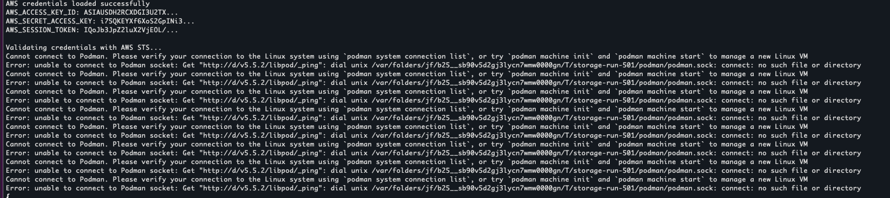
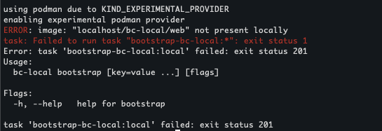
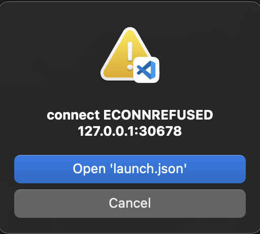

# bc-local
Homebrew Repo for bc-local cask. Launch and run BriteCore Locally 🛳️

## How do I install?

> **Note:** Since this is a homebrew cask there is no need to clone this repository. You just need to have [homebrew](https://brew.sh) installed!

```
brew tap intuitivewebsolutions/bc-local
brew install bc-local
```

## Pre-requisites for running bc-local

```sh
export BRITECORE_CODE_DIR=<path/to/britecore/code/dir>
mkdir -p ~/bc-local-data-load
export BRITECORE_DATA_LOAD_DIR=~/bc-local-data-load
export KIND_EXPERIMENTAL_PROVIDER=podman
export AWS_PROFILE=<profile_name> && aws sso login --profile <profile_name>  # Replace <profile_name> with a profile from ~/.aws/config
```

Add the export statements to the bottom of your ~/.zshrc if you'd like these to be initialized in any new terminal session

## How do I run BriteCore?

> [!WARNING]
> Make sure that your Podman setup has enough resources allocated (≥ 8GB memory) to it in order to run a BriteCore site. You can use the following command to automatically use recommended settings `podman machine init podman-machine-default --cpus 8 --memory 8192 --disk-size 100 --now`. 

This will launch a local britecore site from scratch:
```sh
bc-local bootstrap client=rowanmutual celery=false pytest=false #change args as needed
bc-local status
bc-local open web
```
The site is available once the `web` pod (seen using `bc-local status`) is `Running` all containers.

## How can I use this to develop BriteCore?

```sh
bc-local refresh
```

Make updates to the BriteCore code in the directory specified at `$BRITECORE_CODE_DIR` then run `bc-local refresh`

## How can I use local monitoring tools?

```sh
bc-local monitoring
```

## How can I upgrade my bc-local version?

```sh
brew update && brew upgrade bc-local
```

## How can I get and use the beta version (less stable)
```sh
brew install bc-local-beta
bc-local-beta version
```
bc-local-beta is where we will push the latest features and changes that have been merged to the main source code branch.

## Troubleshooting
----
### ERROR: Missing the following required SSO configuration values: sso_start_url, sso_region
<details>
<summary>Click to expand solution</summary>

You'll encounter this error if your profile isn't configured in your `~/.aws/config` file. You can use the following profile or model a custom profile based on the one below. If you use the profile below, you can retry the authentication process using `export AWS_PROFILE=bcp_engineer && aws sso login --profile bcp_engineer` 

```ini
[profile bcp_engineer]
region = us-east-1
cli_auto_prompt = on-partial
sso_start_url = https://britecore-accounts.awsapps.com/start#/
sso_region = us-east-1
sso_account_id = 313750358190
sso_role_name = BriteCoreProEngineer
duration_seconds = 14400
output = text
```
</details>

----
### ERROR: unable to connect to Podman socket
<details>
<summary>Click to expand solution</summary>



Example terminal error

<br>
This problem typically is due to the podman VM setup not properly creating necessary connections. You can validate the issue by running `podman system connection list` not getting any output.

To fix you'll want to run the following 
```sh
podman machine init
podman machine start
```

Then you should see output upon rerun of `podman system connection list`

</details>

----
### ERROR: image: "localhost/bc-local/web" not present locally
<details>
<summary>Click to expand solution</summary>


Example terminal error

<br>
If you're seeing this and you are able to see the image locally when executing the following 

```sh
podman images | grep localhost/bc-local/web
```

<br>
you can fix by running 

```sh
sudo ln -sf "$(command -v podman)" /usr/local/bin/docker
```

</details>

----
### ERROR: failed pre-install: 1 error occured: timed out waiting for the condition
<details>
<summary>Click to expand solution</summary>
<br> 

Example terminal error:
```sh
Release "bc-local" does not exist. Installing it now.

Error: failed pre-install: 1 error occurred:
	* timed out waiting for the condition

```

<br>
This can be caused because of a long copy-db execution. Typically you can fix thix by including a larger amount of time in the timeout flag

```sh
bc-local bootstrap client=municipal timeout=50m
```

</details>

----
### ERROR: dropping 1005 traces to Datadog Agent ... ([Errno -2] Name or service not known) 
<details>
<summary>Click to expand solution</summary>
If you're seeing many error logs related to the DataDog Agent, it's typically because it's unable to find the bc-local monitoring stack. You can resolve this by launching the monitoring stack 

```sh
bc-local monitoring
```

</details>

----
### ERROR: ECONNREFUSED 127.0.0.1:30678 (when connecting to debugger)
<details>
<summary>Click to expand solution</summary>


Example VS Code error popup

<br>
If you see this error when attempting to connect to the debugger port, this may be because the bc-local kind cluster is not exposing the port. 

You can test this by executing 

```sh
lsof -i TCP |grep 30678
```

which should provide an output like 

```sh
gvproxy ... TCP *:30678 (LISTEN)
```

If you get no output then run the following to fix:
```
bc-local clean
bc-local bootstrap
```

</details>

----
### Issue: Can't get beyond the login screen
<details>
<summary>Click to expand solution</summary>

<br>
If you use correct credentials when attempting to login and it redirects you back to the login screen, this can be caused by using Safari.

<br>
<br>
Fix:
Use a chromium based browser.

</details>
